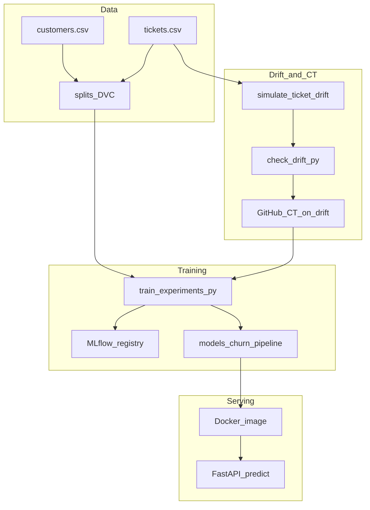
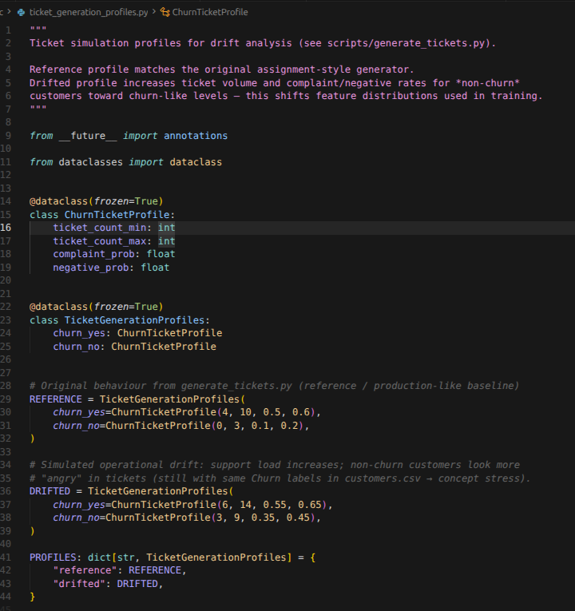
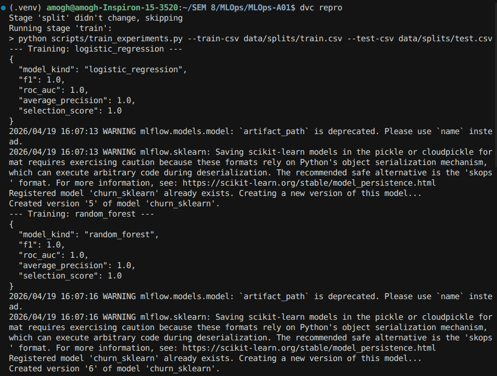
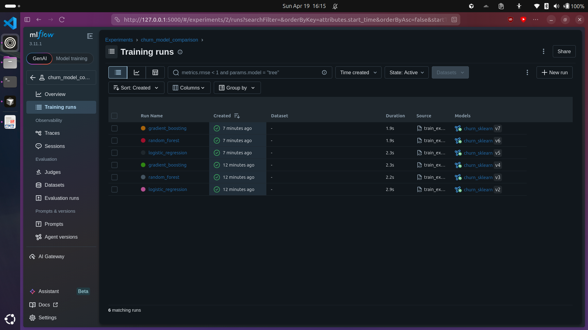
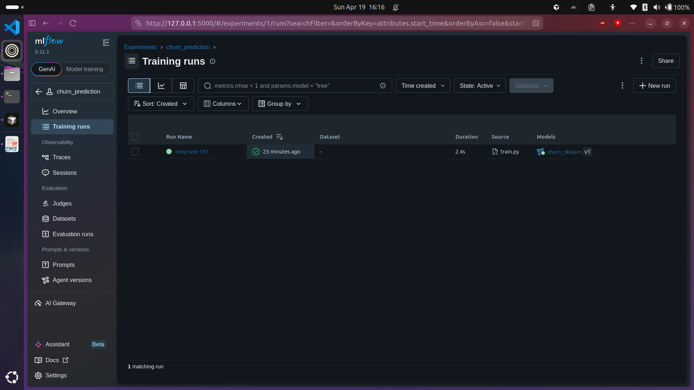
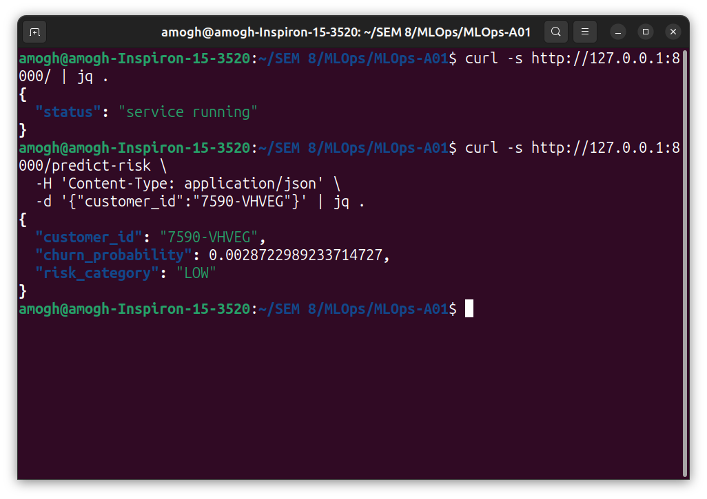
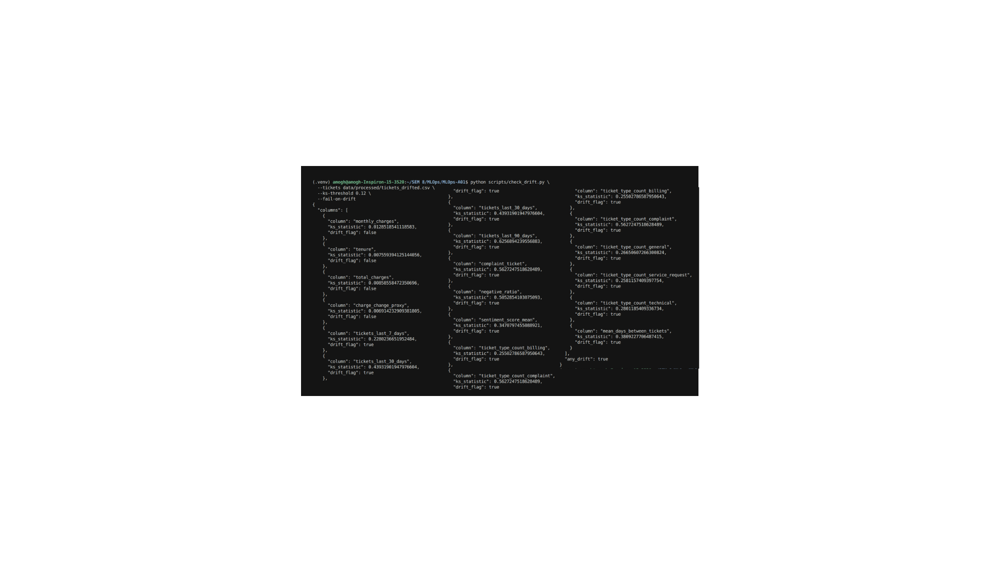
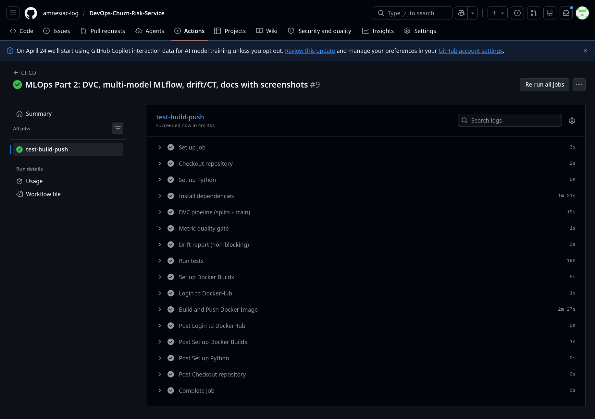
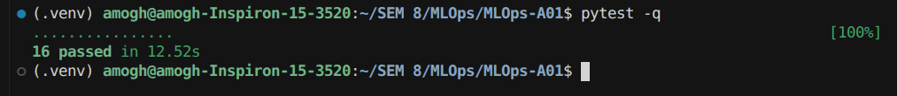

# MLOps Assignment Part 2 — End-to-end walkthrough (stage-wise)

This document maps the course PDF (**Assignment II** + **MLOps transition**) to what is implemented in this repository: **DVC**, **multi-model experiments with MLflow**, **production Docker serving**, **data drift** grounded in the **ticket generator**, **continuous training (CT)** on drift, and **testing**.  
Screenshots for stages **1–8** live under [`docs/screenshots/`](screenshots/) (see [`screenshots/README.md`](screenshots/README.md)); you can still paste extra command output here as notes for your submission.

---

## How the pieces fit together



---

## Stage 1 — Understand ticket generation (basis for drift design)

**Goal:** Explain *how* tickets are produced so drift is scientifically motivated, not random noise.

**Implementation**

- Profiles live in [`src/ticket_generation_profiles.py`](../src/ticket_generation_profiles.py).
- Generator logic: [`src/ticket_generator.py`](../src/ticket_generator.py).
- CLI: [`scripts/generate_tickets.py`](../scripts/generate_tickets.py).

**Original behaviour (reference profile)**

- **Churn = Yes:** more tickets (4–10), higher complaint probability (0.5), higher negative sentiment probability (0.6).
- **Churn = No:** fewer tickets (0–3), lower complaint (0.1) and negative (0.2) rates.
- Ticket types mix **complaint** vs **technical / billing / service_request / general**; timestamps are random within the last 90 days.

**Drifted profile (`drifted`)**

- Raises ticket counts and complaint/negative rates for **non-churn** customers toward “churn-like” behaviour while labels in `customers.csv` stay the same → **covariate shift** in ticket-derived features (`tickets_last_*`, `negative_ratio`, type counts, etc.).

**What you should run**

```bash
# Reference tickets (overwrite tickets.csv only when you intend to refresh data)
python scripts/generate_tickets.py --profile reference --seed 42

# Inspect counts by churn (optional notebook or quick Python)
python -c "import pandas as pd; c=pd.read_csv('data/processed/customers.csv'); t=pd.read_csv('data/processed/tickets.csv'); print(len(t), t.merge(c[['customer_id','Churn']]).groupby('Churn').size())"
```

**Screenshot (required)**

> Capture your editor showing **both** `REFERENCE` and `DRIFTED` blocks in `ticket_generation_profiles.py` with a short sticky note or caption explaining *what* drifts.



---

## Stage 2 — DVC: versioned splits and reproducible train

**Goal:** Satisfy the PDF’s **data versioning** requirement: track **processed inputs** and **train/val/test splits**, then a deterministic **train** stage.

**Pipeline file:** [`dvc.yaml`](../dvc.yaml)  
**Parameters:** [`params.yaml`](../params.yaml)  
**Lock file:** [`dvc.lock`](../dvc.lock) (commit this after changes).

**Stages**

| Stage | Command (via DVC) | Outputs |
|--------|-------------------|---------|
| `split` | `create_splits.py` with `${val_size}`, `${test_size}` | `data/splits/{train,val,test}.csv` |
| `train` | `train_experiments.py` on train/test CSVs | `models/churn_pipeline.joblib`, `models/training_metrics.json`, `models/production_manifest.json` |

**Commands**

```bash
dvc repro          # full pipeline
# or
dvc repro split
dvc repro train
```

**Note:** `data/processed/customer_features.csv` remains **Git-tracked** (historical choice). To put it under DVC, follow the comment at the top of [`dvc.yaml`](../dvc.yaml).

**Screenshot (recommended)**

> DVC DAG or terminal showing `dvc repro` success.



---

## Stage 3 — Multiple models + MLflow experiment tracking

**Goal:** Train **different classifiers** on the *same* splits, log **hyperparameters / metrics / feature list**, comparable to the PDF’s experiment-tracking section.

**Script:** [`scripts/train_experiments.py`](../scripts/train_experiments.py)  
**Models (default):** `logistic_regression`, `random_forest`, `gradient_boosting` — see [`src/model_factory.py`](../src/model_factory.py).

**Selection score (transparent heuristic)**

\[
0.45 \cdot \mathrm{ROC\text{-}AUC} + 0.35 \cdot F1 + 0.20 \cdot \mathrm{AP}
\]

Ties on the scalar score are broken lexicographically by **(ROC-AUC, then F1)** so a unique winner is chosen when metrics are identical across models.

**Commands**

```bash
export MLFLOW_TRACKING_URI="sqlite:///$(pwd)/mlflow.db"   # optional explicit URI
python scripts/train_experiments.py \
  --train-csv data/splits/train.csv \
  --test-csv data/splits/test.csv
```

**MLflow UI:** if your repo path contains a **space** (e.g. `SEM 8`), you **must** quote the SQLite URI so the shell does not split it:

```bash
mlflow ui --backend-store-uri "sqlite:///$(pwd)/mlflow.db" --host 127.0.0.1 --port 5000
```

Then open **http://127.0.0.1:5000** in a browser.

**Screenshot (required)**

> MLflow UI: experiment **`churn_model_comparison`** listing runs named by `model_kind`, sorted by `roc_auc` or `selection_score`.



---

## Stage 4 — Model registry: promote **best** to **Production**

**Goal:** After comparison, **one** model version is marked **Production** in MLflow; others are moved to **Archived** (best-effort; MLflow may warn on deprecated stage APIs).

**Behaviour:** Implemented at the end of [`scripts/train_experiments.py`](../scripts/train_experiments.py) (`promote_best_model_version`).

**Artifacts for Docker / FastAPI**

- Best sklearn `Pipeline` is always written to **`models/churn_pipeline.joblib`** (what the API loads).
- [`models/production_manifest.json`](../models/production_manifest.json) records `best_model_kind` and `mlflow_run_id`.

**Screenshot (required)**

> MLflow **Models** page: `churn_sklearn` with one version in **Production**.



---

## Stage 5 — Production deployment with Docker

**Goal:** Ship the **same** artifact the DVC train stage produced inside an image and run **FastAPI**.

**Dockerfile:** [`Dockerfile`](../Dockerfile) — runs `create_splits` + `train_experiments` **with `--skip-mlflow`** during build (keeps the image self-contained without bundling `mlflow.db`).

**Serving stack**

- API: [`src/app.py`](../src/app.py) — loads `models/churn_pipeline.joblib`, optional manifest log, **Pandera** validation, Prometheus metrics.

**Commands**

```bash
docker build -t churn-risk-service:prod .
docker run --rm -p 8000:8000 churn-risk-service:prod
# other terminal:
curl -s http://127.0.0.1:8000/ | jq .
curl -s http://127.0.0.1:8000/predict-risk -H 'content-type: application/json' \
  -d '{"customer_id":"7590-VHVEG"}' | jq .
```

**Screenshot (required)**

> Terminal split: `docker run` + successful `curl` JSON including `churn_probability`.



---

## Stage 6 — Data drift: simulate from generator, then measure

**Goal:** Tie drift to **ticket code**, not arbitrary noise.

1. **Reference world:** splits were built from whatever `tickets.csv` existed when you ran `dvc repro split` (typically **reference** profile tickets).
2. **Drifted world:** [`scripts/simulate_ticket_drift.py`](../scripts/simulate_ticket_drift.py) writes `tickets_drifted.csv` using the **`drifted`** profile (higher volumes / complaint / negative rates for non-churners).
3. **Measure:** [`scripts/check_drift.py`](../scripts/check_drift.py) rebuilds customer-level features from `tickets` and compares numeric columns to the **frozen** `data/splits/train.csv` with two-sample KS. Default `--ks-threshold` is **0.12** (tuned so the drifted profile **flags** drift).

**Commands**

```bash
python scripts/simulate_ticket_drift.py --output data/processed/tickets_drifted.csv
python scripts/check_drift.py --tickets data/processed/tickets_drifted.csv --ks-threshold 0.12 --fail-on-drift
echo "exit code:" $?    # expect 1 when drift detected
cat models/drift_report.json | head
```

**Screenshot (required)**

> Editor or terminal showing `drift_report.json` with `"any_drift": true` and high KS on `tickets_last_30_days` / `complaint_ticket`.



---

## Stage 7 — Continuous training (CT) after drift

**Goal:** Automate **retrain** when drift is detected (PDF: scheduled retraining + drift).

**Workflows**

- **Drift-triggered CT:** [`.github/workflows/ct_on_drift.yml`](../.github/workflows/ct_on_drift.yml) (manual dispatch; drift gate → retrain).
- **Scheduled CT (no drift gate):** [`.github/workflows/scheduled_retrain.yml`](../.github/workflows/scheduled_retrain.yml) (weekly `dvc repro` + drift report artifact).

**Manual dispatch behaviour (`ct_on_drift`)**

1. Runs `dvc repro split` (ensures splits exist on CI).
2. Writes drifted tickets → `check_drift.py --fail-on-drift` (expected **failure** with drifted data).
3. On failure: `dvc repro train` (multi-model selection + new artifact) + `pytest`.
4. Uploads `drift_report.json`, `training_metrics.json`, `production_manifest.json` as CI artifacts.

**Optional destructive step:** workflow input `apply_drifted_tickets=true` copies drifted tickets over `tickets.csv` before retrain (use only when you understand you are mutating tracked data).

**How to capture this run:** GitHub → **Actions** → workflow **“CT-on-drift”** → **Run workflow** (defaults are fine). After the run finishes, open the job and screenshot the graph (drift step may show failure with `continue-on-error`, followed by **retrain** and **pytest** when drift was detected).

**Screenshot (required)**

> GitHub Actions run for **CT-on-drift**: drift check on drifted tickets, then continuous training and tests.



---

## Stage 8 — Model testing & serving checks

| Layer | What runs |
|--------|-----------|
| Unit / smoke | `pytest` — includes [`tests/test_model_factory.py`](../tests/test_model_factory.py), [`tests/test_train_experiments_smoke.py`](../tests/test_train_experiments_smoke.py), [`tests/test_inference_schema.py`](../tests/test_inference_schema.py), API tests |
| Integration | `tests/test_drift_detection.py` (`@pytest.mark.integration`) — drift path |
| CI | [`.github/workflows/ci.yml`](../.github/workflows/ci.yml) — `dvc repro`, `metric_gate.py`, drift script, `pytest` |

**Local command**

```bash
pytest -q
# skip integration marker if you add exclusion later:
# pytest -q -m "not integration"
```

### Pytest suite (16 tests)

| # | Test node id | Purpose |
|---|----------------|--------|
| 1 | `tests/test_api.py::test_health_check` | `GET /` returns running status |
| 2 | `tests/test_api.py::test_predict_risk_valid_customer` | `POST /predict-risk` returns probability + band |
| 3 | `tests/test_api.py::test_predict_risk_invalid_customer` | Unknown `customer_id` → 404 |
| 4 | `tests/test_drift_detection.py::test_drifted_ticket_profile_triggers_ks_fail` | Drifted ticket profile raises KS drift (`exit 1`) |
| 5 | `tests/test_feature_engineering.py::test_build_customer_features_shape_and_label` | Feature table shape + key columns |
| 6 | `tests/test_inference_schema.py::test_schema_accepts_valid_row` | Pandera accepts valid feature row |
| 7 | `tests/test_inference_schema.py::test_schema_rejects_bad_contract_type_dtype` | Pandera rejects bad `contract_type` dtype |
| 8 | `tests/test_model_factory.py::test_each_model_kind_fits_small_data` | All three pipeline kinds fit on a slice |
| 9 | `tests/test_rule_engine.py::test_high_risk_many_tickets` | Legacy rule engine: many tickets → HIGH |
| 10 | `tests/test_rule_engine.py::test_high_risk_complaint_monthly_contract` | Legacy rules: M2M + complaint → HIGH |
| 11 | `tests/test_rule_engine.py::test_medium_risk` | Legacy rules: MEDIUM band |
| 12 | `tests/test_rule_engine.py::test_low_risk` | Legacy rules: LOW band |
| 13 | `tests/test_rule_engine.py::test_high_rule_boundary` | Boundary at 5 tickets → MEDIUM |
| 14 | `tests/test_rule_engine.py::test_rule_precedence` | HIGH precedence over MEDIUM |
| 15 | `tests/test_rule_engine.py::test_complaint_not_monthly` | Complaint without M2M contract |
| 16 | `tests/test_train_experiments_smoke.py::test_train_experiments_one_model_skips_mlflow` | `train_experiments.py` smoke with `--skip-mlflow` |

**Screenshot (captured)**

> Successful local run: `pytest -q` (16 passed).



---

## Stage 9 — Quick reference checklist (PDF alignment)

All walkthrough screenshots for stages **1–8** are wired above; Stage **9** is the compact index below.

| PDF theme | Where in repo |
|-----------|----------------|
| Feature engineering parity | [`src/feature_engineering.py`](../src/feature_engineering.py) |
| ML classifier + metrics | [`scripts/train_experiments.py`](../scripts/train_experiments.py) |
| Saved artifact + inference | `models/churn_pipeline.joblib` + [`src/app.py`](../src/app.py) |
| Data versioning (DVC) | [`dvc.yaml`](../dvc.yaml), `data/splits/` |
| sklearn `Pipeline` + serialization | [`src/model_factory.py`](../src/model_factory.py) + `joblib` |
| Schema validation | [`src/inference_schema.py`](../src/inference_schema.py) |
| Experiment tracking + registry | MLflow in `train_experiments.py` |
| Drift + CT | `simulate_ticket_drift.py`, `check_drift.py`, `ct_on_drift.yml` |
| Monitoring | Prometheus metrics in `src/app.py` + [`docs/API.md`](API.md) |

---

## Appendix — Ongoing command log

For timestamped commands and deviations, append to [`MLOps_part2_execution_log.md`](MLOps_part2_execution_log.md).
